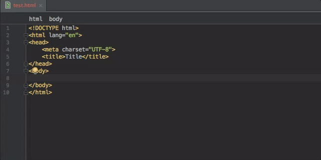

# htl-live-templates
HTL Live Templates

# HTL Live Templates for IntelliJ IDEA

Simplifies writing [HTL](https://docs.adobe.com/docs/en/htl/docs/getting-started.html) Markup in IntelliJ via Live Templates

### Usage
Write "sly-command" or only $ in your html file and press Tab for auto-completion.
Depending on the command, the markup is generated automatically.

### Commands:
#### $
`${$VAR0$}`
#### sly-use
`<sly data-sly-use.$VAR0$="$className$" />`
#### sly-text
`data-sly-text="${$VAR0$ @ context=$VAR1$}"`
#### sly-test
`data-sly-test="${$VAR0$}"`
#### sly-template
`<template data-sly-template.$VAR0$="${ @ $VAR1$}">
    $END$
</template>`
#### sly-resource
`data-sly-resource="${'$VAR0$' @ resourceType='$VAR1$'}"`
#### sly-repeat
`data-sly-repeat="${$VAR0$}"`
#### sly-list
`<sly data-sly-list.$VAR0$="${$VAR1$}">
 $END$
</sly>`
#### sly-include
`data-sly-include="$VAR0$"`
#### sly-comment
`<!--/* $VAR0$ */-->`
#### sly-call
`data-sly-call="${$VAR0$ @ $VAR1$}"`
#### sly-attribute
`data-sly-attribute="${$VAR0$}"`

### Demo

  

### Installation

Install to IntelliJ IDEA, see https://www.jetbrains.com/help/idea/2016.2/sharing-live-templates.html
